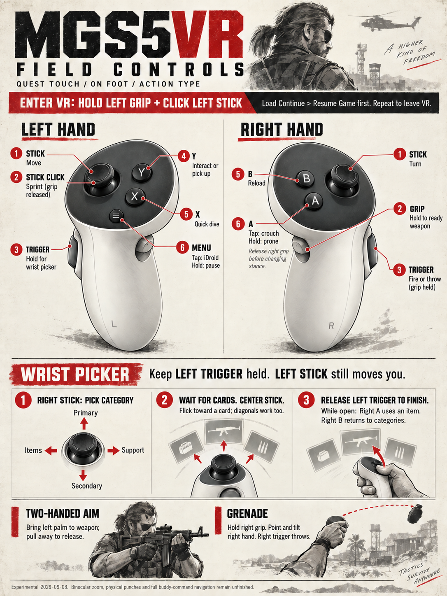

# MGS5VR

Play **Metal Gear Solid V: The Phantom Pain in VR**, with tracked hands and a HUD on your left wrist.

**[Download MGS5VR for Windows](https://github.com/nikamigaming-create/MGS5VR/releases/download/experimental-2026-09-09/MGS5VR-experimental-2026-09-09.zip)**

You need your own PC copy of **TPP 1.0.15.4** and a PC-connected VR headset. Tested on **Quest 3 + Touch controllers**; other headsets are unverified. This is an experimental mod.

## Install

1. Close MGSV. Download the ZIP above and **extract it all**.
2. Open the extracted **MGS5VR** folder and double-click **Install.cmd**.
3. Select **mgsvtpp.exe** in your game folder. Done.

Find the game folder in Steam: right-click MGSV → **Manage → Browse local files**.
Updating? Run **Uninstall.cmd** first. Other mods using `dinput8.dll` must be removed through their own uninstall process.

## Play

1. Connect your headset to PC VR and make its software the **active OpenXR runtime**.
2. Launch MGSV through Steam. Use **Action Type** controls and load **Continue → Resume Game**.
3. **Hold left grip + click the left stick** to enter VR. Use the same combo to leave VR.

No simulator or compiling needed. Install once; launch normally afterward.

## Controls

**[Full controls, grenades and night vision →](docs/CONTROLS.md)**

[All control modes: menus, Commands, zoom, melee and vehicles](docs/images/control-modes.svg)

## Help

- **Sharper picture:** start at 1920×1080 Windowed, Post Processing **High** for AA, Depth of Field **Disable**, Motion Blur **Off**. [More picture settings](docs/PERFORMANCE.md).
- **Install or launch trouble:** [setup help](docs/ADVANCED_SETUP.md#quick-setup-help). You may need the [Microsoft Visual C++ x64 runtime](https://aka.ms/vc14/vc_redist.x64.exe).
- **Remove the mod:** close MGSV, double-click **Uninstall.cmd**, and select the same `mgsvtpp.exe`.

Native binocular marking, powered arms and physical body grabs remain unfinished. Motion melee damage, vehicle driving and all gameplay states are not fully tested. [Current status](docs/STATUS.md) · [Known interaction gaps](docs/SYSTEMS_ACCESS.md)

Community project, not affiliated with Konami. [MIT license](LICENSE) · [Third-party notices](docs/THIRD_PARTY_NOTICES.md) · [Build from source](docs/ADVANCED_SETUP.md#build-from-source)
