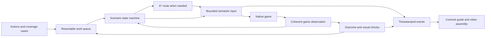

# Gameplay bot, controls coverage and showcase

Current checkpoint: [27 September live supervision, iDroid evidence and field-kit artifacts](BOT_SUPERVISION_STATUS_2026-09-27.md).
The historical specification below remains the full scope; passing the new
bounded sequences does not complete the community campaign or film.

Updated 2026-09-26. This is the automation and delivery specification within the
[community recovery plan](COMMUNITY_RECOVERY_PLAN.md), not a separate project to
defer until after the fixes. Status: **initial maintained bot implemented and
exercised in a live simulator session; full coverage and the final film remain
open**. The original tooling audit below is retained as baseline history. The
implementation evidence in the next section supersedes its readiness snapshot.

## Implementation checkpoint, September 26

The maintained entry point is [gameplay-bot.py](../tools/gameplay-bot.py), backed
by [gameplay_bot](../tools/gameplay_bot/). It uses one operator connection and
input lease per run, fresh process/native observations, effective parsed control
bindings, predicate-driven steps and release-on-failure. A ready predicate advances
immediately; a timeout is a failure deadline. Suite execution does not ask the
assistant to approve each action.

### Current live result

The user closed the game and simulator after severe lag. No game relaunch or
new input followed that instruction. Our Blender/FFmpeg work is stopped too.
Saved recordings and partial render frames are retained; shutdown publications
must not be diagnosed as a new camera failure.

An offline repair now requires an actual native LoadingTips state before a
camera-publication gap may switch to a loading quad. Previously any gap over
500 ms called `awaitScene()`, changed presentation/input ownership, and changed
the activation generation again on recovery. The 150 ms source acceptance and
500 ms maximum accepted-pair retention limits are unchanged. The build and
7,209 core checks pass. New built DLL SHA-256:
`B98D079D724640C0A779848B8339F3149A9710DC4865718194E1312F4865EDD3`.
**This build is not installed or live-verified.** The last installed candidate
remains C431 below. An unreadable/unverified native loading terminal still fails
closed; a generic source stall is not used to guess loading.

The bot has 76 passing Python contracts (63 dispatch/core, four session-pose,
nine locomotion). Its new walking probe reduces stick input before the target
and verifies neutral settling; the braking change has only simulated-dynamics
coverage and still needs native deadzone/speed calibration. Both earlier live
movement probes exceeded their bounds. Standing-to-crouched passed, but the
prone attempts did not. Input expiry was visible during frame gaps, and the
renderer-idle repeat also failed; CPU artwork alone does not explain the lag
or prove the prone control mapping wrong.

The corrected official Quest 3 controller poster is readable. Its 30 FPS render
was stopped at 33 of 140 frames before the first input cue. There is no completed
controller movie or finished lesson from that partial sequence. The first final
film remains open. Resume media work separately from gameplay load.

The user explicitly authorized **normal game and simulator windows for recording**.
The first normal Steam launch reached an immersive field session (MGSV PID
39404, simulator PID 38492). The replacement ergonomic candidate last ran as
MGSV PID 7684 / simulator PID 35476, with DLL SHA-256
`C431578464A06B63F908147A0DA634BB1EC73A10AEA0440407B1E87FB8C02E6D`.
The updater preserved both personal INIs and retained a rollback backup.
OS mouse/keyboard injection, focus changes and
computer-use automation remain prohibited. The private-desktop launch failed
before mod initialization with `0xC0000142`; it is not the current capture path.
The user had closed the preceding game and then its simulator. Stopped render
publications during that older shutdown do not establish a game defect.

`field-context-roundtrip-live-04` ran seven cases continuously: five observed
passes (equipment open/release, VR binocular latch/stow, Pause open/close), one
Commands outcome failure and its dependent case skipped. The source-correct
`commands-held-context-live-01` then passed Commands while X remained held and
returned to gameplay on release. The maintained six-case suite now uses that
held contract. Independent cases no longer stop at a routine assistant handoff.
Binocular equip is not eye-relief, zoom, marking or retail BINOCLE completion.
The native source-eye recording has a main 824-frame segment with seven drops;
115 separately timed operator pose readbacks are retained. These queries are
not atomic compositor-frame poses. Paired final-eye stills remain a separate
capture source.

The user identified the visible Help/tutorial as one they had left open. A
visually identified `A Close` was completed by `observed-tutorial-a-close-live-01`,
returning to freeplay with unchanged player position. Do not attribute that
pre-existing layer to a new iDroid defect. The bot is authorized to complete
tutorials through their actual prompts/actions, not through progression edits.

The current runner has **63 passing core/dispatch tests, four session-pose
tests and nine locomotion tests**. New behavior includes
Menu-first chord formation/release, dependency-aware continuation of independent
cases after bounded outcome failures, sampled-time long holds, and while-held
outcome followed by neutral exit. Missing audit snapshots no longer
erase a hold's first sample; only a new fresh held sample credits elapsed time,
and a fresh contradictory physical sample resets it. This does not prove
uninterrupted XInput delivery through a render stall.

The C431 candidate subsequently completed **all six maintained field cases**
in `ergonomic-field-suite-live-02`: equipment picker, held Commands, binocular
latch/stow, and Pause open/close. Its single source-eye/audio take contains 492
frames over 16.70 seconds, ten dropped frames and no audio gaps. Root reviewed
the held equipment/Commands/binocular frames; the night scene and small menu
text limit their instructional value. This is not full optics acceptance.

The preceding `ergonomic-field-suite-live-01` failed during a right-eye capture
while X remained held. Capture blocked the same operator transport needed to
release X, producing repeated 15-second timeouts. The runner now records timed
held-state checkpoints against its continuous native source-eye video, reserves
final-compositor stills and pose readbacks for neutral input, arms automatic
backend input expiry, releases held axes/buttons first, and stops queuing work
after an ambiguous transport timeout. `during_captures` is empty under this
policy; a source-eye checkpoint must not be labeled a final-eye capture.

The user correctly identified the Security Settings tutorial. The live path
entered Security Settings, opened Basic Settings, read/dismissed its Help card,
and returned through normal Back actions to the field. No security preset or
insurance was purchased/changed; the original level 7 / cost 800 setup remained.
`idroid-navigation-live-01` observed zero native player displacement while the
configured menu stick changed the highlight. Normal exit released the named
player-pad exclusion. The generic saved FOB tutorial enum is not a verified
marker for completion of this particular card.

Concurrent controller-art rendering coincided with stereo source gaps and
native input expiry. GPU rendering was stopped; later CPU poster work also
coincided with interrupted long stance holds and is being isolated from live
input. No freshness threshold was weakened to hide these gaps.

Cold-start evidence first showed an A/confirm action sent 15.202 seconds before
the native prompt-open event. Waiting for that hook fixed the premature timing,
but `ergonomic-candidate-live-01` exposed the second error: its step named
`press-start` still sent A, not START. The game consumed A without opening the
title menu. The 90-second startup deadline ended before any gameplay case ran;
one recording segment also failed to finalize. These are failures, not passes.
`press-start-menu-live-01` then sent the configured Menu tap (native START on
release), which immediately opened the real title menu and immersive cockpit.
The maintained startup branch now uses that action; autosave/loading confirms
retain A. The current-process prompt guard remains. A complete new cold launch
of this combined fix has not yet been exercised.

`ergonomic-candidate-live-02` then completed physical Continue, native loading,
and arrival in mission 30010 / `Seq_Game_FreePlay`, followed by both-hand reset.
Its first equipment case stopped before dispatch because one post-capture
control publication was stale. The runner now reacquires fresh controls for up
to two seconds before dispatch and rechecks action eligibility on that state;
it does not extend the 250 ms freshness limit or replay an ambiguous action.

Current user-directed fit work moves wrist HUD anchors to immediately behind
the hand and gives the iDroid independent screen size, distance, angle and side
offsets. The default screen width becomes 45 cm. Relaxed-palm alignment and
menu navigation without Snake movement has a bounded live check above; relaxed
hand motion, exact projected-device alignment and headset comfort remain open.
Continue's rack-hover pose must be reset before interpreting a field hand pose.
The new candidate contains the 1.5 cm wrist setback, independent iDroid fit and
a named native player-pad exclusion while handheld menus are open. Core checks
(7,207), controls checks (285), and five selected CTest entries pass. The session
runner now resets both hands after a real Continue instead of carrying the rack
reach into gameplay; warm-session poses remain unchanged.

`quad-restore-immersive-02` restored immersive mode at activation 5. Both final
eyes showed the field and hands with stereo parallax. Later, without gameplay
input, `live-inventory-01` found activation 23, `camera_awaiting_player=true`
and reason 7 (`playerHeadUnavailable`). The native camera-observer counter and
captured-frame count stopped increasing while XR theatre submissions continued.
The user's subsequent clarification identifies this as their shutdown sequence;
do not chase it as an independent producer-liveness defect.

The following recovery was itself wrong: `live-inventory-restore-02` issued
Menu+B from the waiting-for-player state. Its events show reason 7 changing to
reason 1 (manual) and context changing to `nativeButtons` at about 1.187 seconds;
the chord switched VR off, despite the later hold-audit failure. The runner now
requires an explicit presentation target and refuses immersive recovery unless
the camera is explicitly in manual quad, with active/pending/awaiting all false.
An inactive player camera is never sufficient authorization to toggle VR.

Next live work records the corrected hand/UI fit, then advances bounded movement
and actual optic/weapon/tutorial outcomes. Camera freshness and input-mailbox
expiry stay intact; extending stale input is not a demonstrated fix.

The generated field-guide prototype is at
`artifacts/field-guide-20260926/index.html`, built from `tools/field-guide/` and
the installed effective bindings: 96 actions, 9 axes and 35 initial situations.
The additional action catalog names 19 loadout positions and 13 bounded state
families. These counts describe documented/observable entries, not passed
gameplay coverage. The early stance clip remains a 3.024 FPS left-eye diagnostic.
The first edited lesson uses actual binocular equip footage. The user rejected
the generic procedural controller; new artwork uses ImageGen and correct Quest
3 Touch Plus geometry, with animated highlights and field-kit callouts. No
finished full instructional film is claimed.

The community candidate `5CA9E7332E9565271FACFB4266655EDCCCD4D488C7488B89553B9D6634AE68CF`
was running in the normal Steam/Meta XR Simulator session. No foreground or
focus change was needed. `live-continue-03` reached mission 30010,
`Seq_Game_FreePlay`, in 18.359 seconds using guarded Press Start, the physical
Continue rack and the observed loading acknowledgment. Both arrival eyes show
the outdoor world and tracked hands.

The new runner had checked Press Start only once, during the earlier preparation
stage, then waited for a selectable menu without re-reading the native startup
sequence. `gameplay_bot/startup.py` now reevaluates native stages until ready,
acknowledges each recognized startup prompt once, and never confirms an unknown
popup or an already selectable menu. Four added regressions bring the bot suite
to **32 passing tests**. The successful live route began with Press Start already
present; the complete cold-start transition still needs a subsequent live run.

`live-posture-run-01` then produced an actual stance transition: a 0.15-second
configured `gameplay.stance` press changed `STAND=true / SQUAT=false` to
`STAND=false / SQUAT=true`. Its fresh resolver audit identifies gameplay, the
physical A press, and XR-published native A (`4096`). This supersedes the earlier
unchanged-stance observations for this candidate; it does not establish the
cause of those older failures.

The continuous left-eye take in `live-posture-finaleye-01/simulator.mp4` contains
the transition. Its compositor metadata records 55 frames over 18.187 seconds,
3.02 measured capture FPS, a successful encoder exit and no capture error.
Both after-action eyes and four video frames were inspected: real outdoor
geometry and hands remain visible, and the viewpoint lowers during the action.
This is bounded simulator evidence, not complete stereo, rig or physical-headset
acceptance. The low capture cadence and roughly 14 seconds of pre-action idle
make this a diagnostic source take, not a finished teaching clip. Capture
throughput and orchestration pauses are being repaired separately from gameplay.

The maintained `session --suite <file>` command now joins guarded startup/Continue
and the entire case queue on the same operator connection and input lease. Each
successful case advances immediately and writes its result before the next case;
an ambiguous failure records the remaining case IDs without replaying inputs.
Four session regressions bring the current total to **36 passing bot tests**.
The legacy request worker's 50 ms poll and client's 100 ms poll do not explain a
fixed 20-second pause. In the first successful posture video, per-image compositor
RPCs take roughly 0.3 seconds, while recording began about 14 seconds before the
action. Those measured capture/orchestration costs are distinct from a native
game pause. A session queue removes the assistant handoff between its actions.

The subsequent native-binocular assay remains a real failing action, not a
delivery failure: its held right-grip mapped to native RB (`512`) and the game's
XInput hook consumed that value. The corrected 23.9-second monitor observed 120
live native samples, with `BINOCLE=false` throughout the 1.4-second hold and
afterward. It retained native-button mode while checking the outcome. This
narrows the next investigation to retail control layout/action availability and
camera integration; it does not prove or fix the Mission 1 tutorial. The original
assay, which checked only after leaving native-button mode, is retained separately
as an inadequate postcondition test.

### Earlier runs and deployment history

The first instrumented live DLL was
`3606D0C10F4ECE5E2204A78E75285AFE89636247A6BDEB8D47ABCDF471430953`,
built from the uncommitted September 26 work on source `932d786`. Each run records
its own installed DLL/configuration identity; subsequent builds must not inherit
that candidate's results. Meta XR Simulator v207 was used with the existing
operator proxy. The installed `handheld_menus=1` setting was preserved.

| Capability / case | Evidence and present limit |
| --- | --- |
| Effective bindings | `mgs5vr_controls --bindings-json [controls.ini]` exports the actual parser's action contexts, gestures, timing, axes and settings, including overrides and disabled entries. This is the dispatch map, not a verified catalog of all native game interactions. |
| Fast observation | `inspect-bot-state` works during Lua suspension and reports independently sampled scene, camera and input publications. The added input audit exposes freshness, resolver context, sampled physical input and the published XR gamepad mapping. Published input is not native action acceptance. |
| Continue route | `continue-02` reached outdoor gameplay through observed startup/title/Continue/loading states in roughly 13–15 seconds from run start. Both arrival eyes were inspected. One successful route is not the ten-run B1 gate. |
| Menus | Pause open/close and iDroid open had observed native outcomes. Normal iDroid Back failed; held Back closed it but revealed an additional tutorial acknowledgment, so that case correctly failed its gameplay-return condition. A separate visually grounded acknowledgment returned to gameplay. |
| Posture | The 0.15s tap and 0.85s hold both reached the game's XInput hook as A (`4096`), followed by release (`0`); neither changed native posture. In each 8s outcome window, all 58 native status samples stayed `STAND=true`, `SQUAT=false`. The Lua predicate uses `PlayerInfo.AndCheckStatus` with retail `PlayerStatus` constants, matching the API used by owned `TppPlayer.lua`. This confirms input delivery and a valid unchanged-state observation; it does not expose why retail gameplay rejected or failed to dispatch the stance action. No stance fix or root cause is claimed. The older runs lack the fresh resolver audit. |
| Capture | Both-eye final-compositor stills reject blank images. Real native source-eye video and process audio were captured for the failed posture cases. These are failure evidence, not finished tutorial clips or continuous final-compositor video. |
| Navigation | A* accepts only explicitly validated edges, preserves floor identity and rejects unknown edges. Native movement-query integration and closed-loop route execution remain open; no live navigation pass is claimed. |
| Contracts | The initial four targeted CTest entries passed, including 14 Python bot contract tests. Later changes require their own verification; these checks do not establish gameplay or headset acceptance. |

Private run manifests, events, result files and captures are under
`artifacts/bot-20260926/`. The `continue-02`, `menu-01`, `idroid-recovery-01`,
`tutorial-ack-01`, `posture-01` and `posture-hold-01` directories distinguish
success, bounded telemetry observations and failures. Native source-eye recording
metadata and final-compositor captures retain their different provenance.

B0/B1/B3/B6 are partially implemented. Resumable scheduling, the native context
inventory, verified interrogation, full equipment execution, live navigation,
capture rotation acceptance, controller overlays, the searchable clip guide and
the complete film are still required. No community defect or physical-headset
gate is closed by this checkpoint.

The subsequent Luna implementation/review checkpoint is retained privately as
`artifacts/bot-20260926/implementation-checkpoint.json`. It records **28 passing
bot contract tests**, Python compilation/diff checks, and the prior successful
bindings export plus three targeted CTest entries. The bot now requires a fresh
resolver context and held-input sample newer than action admission, rejects
nonfinite audit values, and reports recording faults on the next observation
while leaving input release/finalization available. An in-flight RPC can delay
fault detection. The candidate DLL is
`DFA78E33812865B79880FF42751371F544CD8BAB821A45AEBA6DC5BECCC3AB70`;
it was installed with a verified backup, but its new controls audit has not been
exercised live. The deployment-time process inventory found no game or simulator.

Deployment update: the installed SHA-256 matches the candidate above; the game
executable and both configuration INIs retain their recorded hashes. The prior
DLL/config copies and deployment evidence are retained under
`artifacts/bot-20260926/deployment-backup-20260926T142838505Z/`. No game launch or
Steam restart occurred during deployment. A later supported-helper attempt and
one retry created private-desktop game PIDs 12332 and 35324; both exited before
native log/render progress while the active desktop remained `Default`. This
background setup is unsupported by the observed runs for now. The helper's
`-Status` record compatibility error was fixed; it reports both attempts exited.
No Continue or posture input was sent in those runs, and installation identity
does not count as a live pass for the new input audit.

The subsequent community repair package is
`dist/MGS5VR-community-20260926.zip`, DLL SHA-256
`5CA9E7332E9565271FACFB4266655EDCCCD4D488C7488B89553B9D6634AE68CF`.
It contains the first cutscene/input/editor repairs described in the
[recovery plan](COMMUNITY_RECOVERY_PLAN.md#first-repair-candidate--september-26).
Its eight selected CTest suites and staged-package installer fixtures pass;
the Lua presentation fixtures pass in isolated Lua 5.1. It was subsequently
installed through the staged package updater: installed DLL/checker hashes match,
and both personal INIs are byte-identical. The verified prior files are retained
in `artifacts/bot-20260926/deployment-preupdate-20260926T081117255-0237d825a0e04153a5cd35594f30889c/`
alongside the updater's normal recoverable backup. The user authorized the main
screen for footage; the normal Steam session now has the live results above.
The development bot and
background helper remain repository tools, not a claim of an included finished bot.

## Required end result

One sustained single-player workflow should enter an identified game session,
reach known scenarios, exercise the applicable controls and equipment, detect
failures, resume after bounded recovery, and produce evidence-linked results.
Those same results drive a complete contextual controls guide, short playable
tutorial clips with controller close-ups/callouts, and the finished showcase.
The defect fixes, bot and video are all deliverables of this program.

The bot must continue through its work queue without returning control to the
assistant after each 20-second action/clip. Recording segments are storage and
editing boundaries; they must not pause gameplay. Wait for observed readiness
with a deadline and progress signal. Preserve required gesture durations and
actual native loading, but remove arbitrary idle delays after completion.
Interrupt the user only for an unresolved prerequisite or an unsafe/ambiguous
recovery; routine retries and successful cases need no conversation round trip.

Completion means repeatable autonomous execution of the declared coverage suite
and an honest result for every case. It does not mean an arbitrary input player
that wins every possible mission. The suite must grow to cover all eligible
equipment IDs and supported native action contexts, rather than a showcase of
one representative rifle. Physical-headset acceptance remains a separate gate.

## Recovered tooling before implementation

Inspected against source `932d7863b7a808e28cf7d6734d3a2ab79f6a67f0` and local
historical artifacts on September 26. Private artifact paths below are discovery
references; they are ignored by Git and are not portable shipped tools.

| Capability | Existing entry point / evidence | Readiness and missing work |
| --- | --- | --- |
| Launch with simulator/operator | [launch-simulator.ps1](../tools/launch-simulator.ps1), [launch-steam-simulator.ps1](../tools/launch-steam-simulator.ps1) | Real launch/configuration machinery exists. No integrated launch-to-play supervisor with measured state-by-state readiness. |
| Persistent semantic input | `artifacts/gameplay-runner.py`, `artifacts/gameplay-request.py` | Buttons, head/hand poses, trajectories, captures, session/request IDs and action logs. Executes supplied sequences; no route planner or general gameplay outcome verifier. Machine-specific proxy path; private scripts need promotion into maintained tooling. |
| Recovery mechanics | Same runner/request client | Rejects wrong sessions and unresolved prior requests; avoids retrying ambiguously completed inputs. Runner has 45-minute lifetime/15-minute idle limits, and request client has a fixed 50-second wait. Per-request exceptions record an error, while final input release is at runner shutdown: failure neutralization needs explicit improvement. |
| Native state access | [native-actions.py](../tools/native-actions.py), [native bridge](NATIVE_ACTIONS.md), [scenario-state.lua](../tools/scenario-state.lua) | Named-pipe transport and game-thread Lua observation exist. Scenario snapshot covers mission/sequence/position/yaw, demo/save/death, gear and buddy basics. It is not a full coherent snapshot of menu focus, native subcontext, guard choices, collision, action result and XR ownership. |
| Continue interaction | `artifacts/showcase-20260920/21-walkthrough/continue-tape.py` | Reads the published rack anchor and computes a hand target. Useful recovered behavior, but uses fixed waits/capture steps rather than a complete checked launch state machine. |
| Navigation | Native clearance/floor code in [controller_rig.cpp](../src/controller_rig.cpp) and [cabin_walk.hpp](../include/mgs5vr/cabin_walk.hpp) | Cabin camera collision is useful groundwork. No general A*/navigation planner was found in the audited Python runner/tools. Cabin camera clearance is not proof of traversable routes for the player body in the field. |
| Local movement scripts | For example `artifacts/showcase-20260920/22-equipment/vehicle-approach.json` | Fixed forward input for two seconds followed by capture. This is a timed movement primitive, not arrival detection or obstacle avoidance. |
| Equipment enumeration | [equipment-coverage.py](../tools/equipment-coverage.py), [its fixtures](../tests/equipment_coverage_tests.py) | Enumerates owned definitions/grades and creates per-ID cases without claiming success. Needs reconciled player eligibility, contextual cases, executable scenario assignments and results ingestion. |
| Broader coverage inventory | `artifacts/showcase-20260920/29-current-coverage/full-showcase-matrix.json` | 899 definitions, all `not_run_on_candidate`; `inventory_complete=false`. Candidate is historical v11, DLL `a251c9affadb1f77862e48e4cf3c6b4ef0e1044bee3f1a0d01f1e788ab9ebe48`. These include resources/unresolved entries, not 899 playable weapons or 899 passes. |
| Contextual coverage history | Same matrix; [both-game coverage](DUAL_GAME_SIM_COVERAGE.md) | Matrix has 28 systems: 2 bounded passes, 7 partial passes, 2 known failures, 17 not run on that candidate. Older individual weapon/actor clips are useful evidence but do not automatically transfer to current source. |
| Controls documentation | [binding definitions](../src/controls.cpp), [controls checker](../tools/controls-check.cpp), [CONTROL_SCHEMA.json](CONTROL_SCHEMA.json), [SVG generator](../tools/render-control-schema.py) | Parser/defaults and seven human-authored display groups (62 rows) exist. `--list` exports defaults; `--settings-json` exports settings. Neither is a complete effective-binding/native-subcontext/outcome catalog. |
| Final compositor capture | [record-simulator.py](../tools/record-simulator.py) | Real composited-eye PNG streaming to MP4 with measured cadence, 45-second/12 MiB limits and 720p output height. Sequence language supports wait/button/pose; completion means commands completed, not that gameplay succeeded. One selected eye per take; no audio in this MP4 path. |
| Native eye and audio | [native recorder](../src/native_video.cpp), [process audio](../tools/capture-game-audio.cpp), `artifacts/showcase-take.py` | Native source-eye video plus process audio, QPC synchronization, projection metadata and per-take hashes. Source precedes final runtime crop/composition; cannot substitute silently for final-headset evidence. |
| Edited showcase | `artifacts/assemble-dual-showcase.py`, [showcase direction](SHOWCASE_DIRECTION.md) | Real footage, audio, captions, side-by-side and wipes were assembled into a historical partial edit. It lacks the requested exhaustive current-build guide, event-driven controller close-ups and automatic case-to-video delivery. |
| Reusable operating knowledge | Installed MGS5VR live-session, forensic, Continue, actor and capture skills; navigation and VR acceptance skills | Procedures describe how to operate and assess these pieces. They are not an executable game planner or proof the current runtime is healthy. |

At the start of the audit, no matching MGSV, Meta XR Simulator or gameplay-runner process
was observed. `runner-state.json` says `ready=false` and is dated September 20.
The last request and response IDs matched, but they were historical. This was the
pre-implementation snapshot; current runs use their own identities and evidence.

This supports a precise answer: there is a substantial **automation harness and
evidence archive**, but not yet the integrated autonomous gameplay bot requested.
Recover proven primitives and contracts; do not rebuild the whole stack or assume
the archive is a finished suite.

## Architecture: observe, decide, act, verify

Use a hierarchical state machine for session, menu and gameplay behaviors, and
A* for navigation over validated movement edges. The assistant selects work and
investigates defects; the executable bot handles the frequent observation/input
loop. A* does not determine which interrogation response is legal, and a button
macro does not determine whether the player reached a destination.



The observation contract includes process/session generation, source/DLL/config
identity, scene and menu state, player/camera/root poses, support floor, posture,
travel mode, equipment/attachments/ammo, target identity/range/availability,
interaction profile and input owner, accepted action state, frame/pose generation,
and field validity/age. Add only fields needed for an initial vertical slice;
unknown is explicit, not a guessed value. Read native facts on their valid thread.
Correlate observations rather than presenting independently sampled values as
one simultaneous transaction.

Each behavior defines entry preconditions, observation, action, expected effect,
deadline, success, failure reason and recovery. The input executor resolves
semantic actions through the **active** bindings/profile. It logs intended input,
actual sampled/mapped input where observable, native acceptance and visible result
separately. A successful RPC or an ammo counter alone is not a complete pass.

Use one session/input owner and lease so capture/helper scripts cannot fight over
controllers. Neutralize held controls on every aborted action, reconnect or
context switch. Do not retry a non-idempotent action after an ambiguous timeout;
observe whether it occurred first. Capture can run concurrently without becoming
a second input owner. Store the queue and completed evidence so interruption does
not mean repeating a full evening of tests.

## Get into play quickly and keep operating

Implement an explicit startup path: process/runtime readiness -> actual native
title state -> visible intended Continue selection -> one fresh confirm -> real
loading/Resume when required -> accepted player camera and live final-eye frame.
No blind repeated A pulses. Loading progress and readiness are different from
"the executable exists" or "the title closed".

Measure cold launch, title handling, native loading, operator transport, Lua
readiness and first usable frame independently. The earlier reports of
20-second pauses have not all been attributed. Instrument those intervals
before attributing all delay to MGSV or deleting necessary waits. Once a state
predicate succeeds, advance without an additional fixed delay. A deadline detects
a stall; it must not become the ordinary wait duration.

Maintain one warm session for a suite. Batch compatible cases by location,
equipment/target availability and setup cost. Reuse an ordinary native checkpoint
where appropriate; title/Continue is itself a tested route, not preparation for
every weapon. Distinguish a dead runner/operator from a dead game; reconnect the
owned transport without killing the game. Respect real save activity and native
transition locks.

Background operation is a delivery requirement: the user must be able to use the
computer while the bot runs. Helpers use hidden processes, and evidence is saved
without opening previews. A background launch must preserve the user's active
desktop, focus and input. `-Headless` currently requests simulator mode and does
not establish a hidden MGSV render path; minimizing MGSV has stopped native
rendering in recorded testing. Verify any isolation setup with advancing native
simulation, XR frames, actual action outcomes and capture/audio before declaring
it unattended-ready. Record resource use and preserve foreground usability.
Window invisibility and a live process are insufficient acceptance evidence.

Extend capture into bounded, independently finalized segments with a shared
timeline, automatic rotation and storage budget. Playback delivery can be short
clips or a long film while the bot runs continuously. Establish actual capture
throughput/resolution/audio before promising smooth final-eye video. The existing
slow PNG RPC recorder is useful for proof but is not automatically a production
showcase recorder. Encoding at 30/60 fps cannot create missing temporal evidence.

## Navigation that stops thrashing

1. **Query native movement constraints.** Reuse verified collision/floor access
   where appropriate and establish a read-only adapter for the actual player
   dimensions, step/slope limits, stance and traversal capabilities. Investigate
   an available native navigation/portal graph before constructing another one.
   If unavailable, build a bounded local graph from validated support and swept
   movement queries. A point ray or cabin head-sphere test is insufficient.
2. **Represent legal routes.** Nodes include floor/height/cell so bridges and
   stacked spaces cannot collapse to the same X/Z. Edges require full clearance
   and encode door/ladder/vault/mount interactions explicitly. Unknown/unloaded
   geometry is not free space. Cache by content/build, scene and actor capability.
3. **Run A*.** Use validated edges with distance and nonnegative traversal costs;
   choose an admissible distance lower bound or zero heuristic where special
   traversal invalidates that bound. A goal is a usable approach pose/range, not
   merely an object's origin. Do not shortcut diagonally through corners.
4. **Execute under feedback.** Issue bounded stick/turn intent through normal
   controls, observe native displacement, heading, support floor and target range,
   and adjust toward the next waypoint. Camera motion alone does not prove body
   movement. Required interactions are checked sub-behaviors.
5. **Recover with evidence.** After insufficient progress, release input and
   distinguish menu ownership, posture/animation lock, transport loss and actual
   collision. Mark a blocked edge with reason/expiry, replan from observed pose,
   and bound repeated recovery. Do not alternate the same ineffective directions.
   If no legal route is known, fail that case with a useful trace and capture.

First navigation acceptance: clear route, concave obstacle requiring a detour,
narrow doorway, stairs/ramp, bridge/stacked floor, moving obstacle, unreachable
target, and scene reset. Check both directions. The deliberately blocked case
must fail without tunneling or infinite retries. No teleport, collision bypass
or transform write counts as successful traversal. Field navigation, horse,
vehicles and cabin roomscale are separate capability profiles.

## One contextual action catalog for bot, tests and player instructions

The initial [native context inventory](NATIVE_CONTEXT_COVERAGE.md), backed by
[machine-readable records](NATIVE_CONTEXT_COVERAGE.json), now defines 35 coverage
obligations in 10 families. Binding references were checked against all 96 actions
and nine axes in the current default export. It separates source routing, native
identity gaps and observed outcomes; it remains incomplete and is not an
executable suite. Helicopter transport, individual mounted roles, interrogation,
postures and five cinematic/sequence classes have explicit obligations. Resolve
each run's custom bindings and fill the missing guards before generating cases
or presenting those actions as verified player instructions.

Preserve [CONTROL_SCHEMA.json](CONTROL_SCHEMA.json) as the existing display input
while migrating it to generated verified action records. The read-only
`--bindings-json` export provides effective bindings, contexts, gestures,
modifier flags, analog sources and disabled actions from the actual parser.
Native subcontexts, runtime precedence, profile availability and per-action
outcome evidence still need to be joined to it.

Join those mod bindings to observed native subcontexts. The eight existing
`ControlContext` values are coarse dispatch categories, not a complete inventory
of the game's interactions. At minimum enumerate:

- On foot standing/crouched/prone/rolling, ready/lowered weapon, support/reload,
  carry, cover, traversal, restraint and stun/death/retry.
- Hold-up, CQC grab, restraint, interrogation menu, available questions/orders,
  confirmation/answer/intel, release, knockout/lethal outcome and body handling.
- Equipment categories/browse/alternate attachment actions; each item/weapon's
  use, cancellation, depletion, alternate modes, optics and charge/guidance.
- Binocular equip/raise/zoom/mark/analysis/clear/stow, independently from scopes.
- iDroid map/tabs/tutorials/support/deployment, Pause/Options, title/loading,
  noninteractive and interactive scripted sequences.
- Horse, driver/passenger, each turret/mortar/APC/tank/helicopter role; buddy
  commands/availability and powered-arm remote-camera return.
- Motion-controller normal/native-button mode, actual Xbox ownership, runtime
  focus/tracking loss and every permitted transition between those modes.

For each native subcontext, list every supported key/axis/hold/chord, what it
does, its prerequisites, incompatible/consumed combinations, how to exit, and
whether it has been verified. Enumerate actual native choices and eligibility;
do not invent interrogation options from memory or assume all guards offer the
same menu. Retain localization-independent identity plus display text when
available. Missing native observation is an instrumentation task, not a guessed
control description.

Each action record needs these fields:

```text
action_id; game; native_context; equipment/target eligibility
preconditions; binding references; effective config/profile identity
gesture/hold/chord/axes; precedence; neutral/release requirements
expected native change; visible/audio feedback; required final-eye check
exit/cancel; timeout; failure reasons; bounded recovery
applicable variants; linked community report IDs; executable scenario
result by build/device; evidence/timecodes; player explanation
```

Example vertical slice: approach a real eligible guard -> establish hold-up or
restraint -> verify the native command menu -> observe available choices ->
resolve the effective Commands/navigation/confirm bindings -> ask a supported
question -> observe the native response and revealed intel -> close/release ->
verify normal movement. Log failed preconditions and unavailable choices. A clip
showing X/A pressed without a response does not pass interrogation.

The same record generates the bot action, test expectation, player binding table
and video caption. Custom bindings must produce corresponding instructions;
neither the bot nor the overlays should silently use old default combinations.

## Coverage: make the denominator real

Reconcile the 899-definition matrix, the separate 687-entry equipment catalog,
owned-table worklists and contextual-system lists. These are different historical
inventories, not interchangeable totals. Preserve aliases, grades, stock/custom
status, game/build and exclusions. Establish which IDs are player-accessible,
NPC/demo/resource-only, currently locked, unsupported or unresolved. Never count
an excluded/unavailable case as a pass or silently drop it.

Run the required per-ID equip/use/effect/reload/alternate/optic/switch/stow cases
for every eligible weapon/item. Cases must assert effects: visible impact plus
native ammo; actual reload; explosion/inflation; guard response; changed intel;
or actual placement. Shared models do not transfer every grade's result. Stock
and customized equipment need distinct identities and declared coverage.

"Every permutation" becomes a finite, inspectable suite:

- Exhaust every legal action and declared exit in every supported native context,
  every eligible equipment ID's required actions, and relevant input-owner paths.
- Explicitly cross high-risk factors: stance x firing/placement, compact support
  x roll/tracking, scripted transition x menu/input, and pad x aim/optic mode.
- Exercise valid/invalid chords, held-input transitions, boundaries and failures.
  Use risk-based pairwise coverage for remaining independent settings/profile
  combinations, and sampled boundaries for continuous motion/fit values.
- Keep physical runtime/controller coverage separate. Report exact covered,
  failed, blocked, unavailable, excluded and not-run counts plus evidence.

It is not possible to exhaust continuous physical poses and all configurations.
Do not use that fact to replace per-item and per-context coverage with a few
representative demos. Define and expose the finite denominator and unmet cases.
Unlock or setup requirements remain visible. No save/progression mutation, debug
placement, fake actor or native debug fire call is accepted as gameplay proof.
Any separately authorized disposable fixture preparation is labeled and isolated
from the actual tested input/action sequence and original user progress.

## Video and guide delivery

Deliver a searchable local controls/action guide with short video pop-ups, an
indexed full walkthrough covering the supported suite, and a polished shorter
showcase. Retain the existing visual direction and historical combined TPP/GZ
requirement; TPP is first, and GZ retains an explicit separate adapter milestone.
GZ third-person preview footage must never be labeled finished first-person VR.

Each short teaching clip should show context -> physical combination -> native
action -> result -> exit. Use a large readable controller inset with pressed
controls and hold/chord timing, a synchronized actual gameplay view, and pointers
to the relevant target/UI/effect. The inset is a clearly identified instructional
diagram driven by captured input events; it is not fabricated gameplay. If using
a crop of a rendered hand/controller, use the matching source frame. Target
callouts must be tied to observed/projected targets in that take, not guessed
screen coordinates reused across camera motion.

Record one monotonic/QPC-linked event timeline for raw input, resolved action,
native state acceptance, target/result and capture/audio timing. Existing
`actions.jsonl` and source/audio metadata are foundations; add the missing joins
and per-step times. Explicitly preserve unknown/unobserved timestamps. Overlays
must depict actual inputs, including a failed action when explaining a limitation,
rather than merely animating the intended script.

Side-by-side layouts must state their meaning: synchronized controller/input
versus gameplay from one take; matched before/after at the same scenario; or
TPP/GZ action comparison. The latter is editorial comparison, not stereo or
pixel-parity proof. Preserve native aspect, useful detail and audio, with no
stretched eye images, interpolated gameplay, hidden failure cuts or misleading
frame-rate claims. Keep the unedited take and timecoded source index.

The renderer should consume verified action/case IDs and evidence ranges. Missing
footage prevents a "complete" chapter; old-build footage is labeled historical.
Validate durations, source/build/config identity, audio, caption/input sync,
readability, pointer targets and both-eye evidence. Inspect full motion sequences
and the assembled film. Evidence clips remain distinct from the edited narrative.

## Integrated implementation milestones

These milestones run alongside W0-W8 in the master plan. Stable tracked code goes
under `tools/gameplay_bot/` and its tests; captures and owned data remain private.
The checkpoint above records the initial implementation without changing these
completion gates.

| Milestone | Implementation and dependencies | Completion proof |
| --- | --- | --- |
| B0: recover and measure | Inventory proven scripts by source/build, preserve their evidence, promote useful runner/request/take code, replace machine-specific paths with configuration. Add timing for startup, transport, readiness and capture. W0. | One reproducible entry point reports health and actual delay breakdown; no hidden reliance on an untracked personal script. |
| B1: reliable session and actions | Single input owner, fresh observation, checked startup state machine, neutral-on-failure, state predicates/deadlines, resumable queue and warm-session reuse. W0/W1/W5. | Ten consecutive launch-to-field attempts on the candidate, plus reconnect/no-progress/wrong-session failures; no blind confirm, stuck hold or arbitrary post-ready waits. Startup elapsed times are reported, not guessed. |
| B2: real navigation | Verified query adapter, A*, feedback executor, interaction edges and bounded recovery. W1/W2. | Navigate the declared route suite, detour around an obstacle and correctly reject an unreachable target without oscillation or teleport. |
| B3: contextual action coverage | Effective binding export, native subcontext observations and action records; connect legal inputs to native outcomes. W1-W6. | Complete and regenerate all keys/combinations for the first interrogation route plus firearm/reload, menus and a mounted route. Unknown choices remain explicit; missing functionality becomes a linked defect. |
| B4: one complete vertical slice | Join B1-B3 and fix blocking W1-W5 defects. Launch, navigate, interact/interrogate, verify intel, equip/fire/reload, place/detonate an item, menu close/reopen and a confirmed end state. | Three uninterrupted runs on the same candidate, with no assistant directing individual steps; injected blocker produces bounded recovery or an explained failure. Each action has independent outcome evidence. |
| B5: scale coverage continuously | Reconciled inventory, scenario/setup grouping, per-ID execution, high-risk cross-products, persistent reports and change-based retesting. All owning W streams. | At least a one-hour supervised autonomous suite without routine 20-second handoffs; resumable results, bounded resource use and explicit coverage denominator. All supported cases must eventually pass for completion, not merely this soak. |
| B6: synchronized capture and teaching prototype | Continuous segmented final-eye capture, audio/event joins, controller inset and callouts; generated guide/pop-up clips and assembly. Start alongside B3/B4. | One interrogation and one weapon clip accurately explain every input, outcome and exit. Capture throughput/audio/quality are sufficient on the actual path; rotating files does not pause the bot. |
| B7: final acceptance and film | Freeze identified candidate after suite fixes; rerun affected hardware gates, generate full guide/index and final edited showcase from current evidence. W7 and required W8/game adapter work. | Every promised feature has a passed case and usable clip; complete indexed walkthrough and polished film match the release DLL/settings. No untested equipment, preview adapter or blocked feature is advertised as finished. |

The first implementation slice is B0/B1 together with W0/W1: make session state
observable, fix the transition/control blockers, and automate reliable entry and
one known gameplay route. Build B2 navigation against a bounded verified area,
then interrogation/combat outcomes. Prove B4 before scaling a hundred unreliable
macros. Build the B6 teaching prototype early so footage is captured in a usable
form from the beginning.

## Operating knowledge and handoff

### Model and token budget

At the user's request, bot implementation and log triage use a **Luna worker at
Max reasoning** with a compact, task-specific handoff. It owns the live input
lease while operating; a second worker or reviewer must not drive the same game.
The integration reviewer reads the changed contracts and concise evidence summary,
not another copy of every log or the full conversation.

Frequent polling, result aggregation, timestamp joins, inventory counting and
routine scenario execution belong in deterministic programs. The worker receives
the failed case, relevant bounded log excerpts, candidate identity and expected
outcome when investigation is needed. A handoff reports changed files, checks,
case counts, evidence paths, exact live state and unresolved causes. Use deeper
integration review for conflicting evidence or changes to shared camera/input/
native-game contracts. Avoid repeated large-log reads and per-action model calls.

### Evidence handoff

Use the installed skills as scoped procedures: MGS5VR live-session for readiness,
opening-continue for title handoff, forensic recovery for historical scripts,
native-actors for legitimate buddy/animal availability, compositor-capture for
truthful eye recording, game-collision-navigation for query/planner/executor
separation, and VR visual QA/headset acceptance for evidence. They supply useful
rules and entry points; the maintained bot must implement the repeatable parts.

Every bot failure should produce a concise bundle: case/action ID, last valid
observation, intended and observed input, native result/rejection, planned route
and actual motion where relevant, timeout/recovery attempts, final-eye excerpt,
and source/DLL/config identity. Link it directly to the master report ID or add a
new one. Fix the defect, rerun the case and its affected neighbors, then resume
the queue. Repeated failures must not create repeated aimless movement.

Completion of this document is not completion of B0-B7. The program ends when
the corrected mod, usable bot, verified contextual controls guide and final video
are delivered with the stated coverage and hardware limits.
